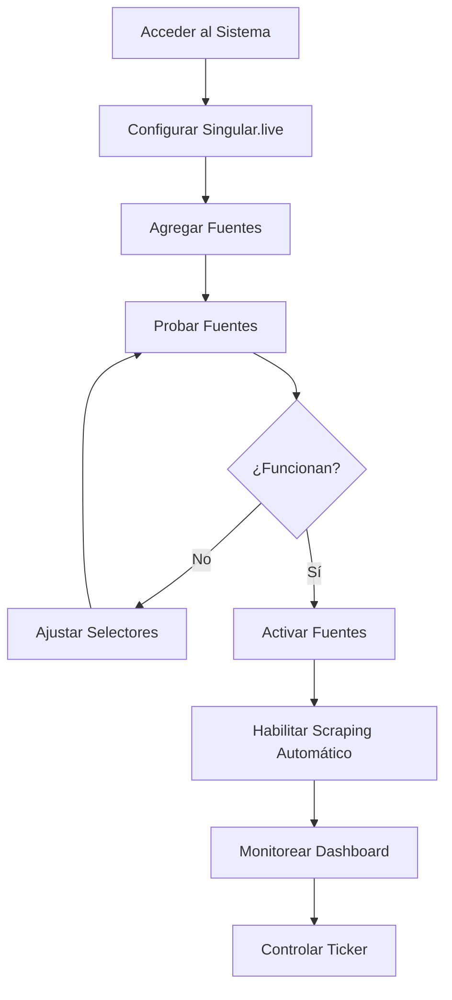

# 📚 Guía de Usuario - News Scraper

**Versión**: 1.0.0  
**Última actualización**: Diciembre 2025

---

## 📑 Tabla de Contenidos

1. [Introducción](#introducción)
2. [Primeros Pasos](#primeros-pasos)
3. [Configuración Inicial](#configuración-inicial)
4. [Gestión de Fuentes](#gestión-de-fuentes)
5. [Uso del Dashboard](#uso-del-dashboard)
6. [Control del Ticker](#control-del-ticker)
7. [Visualización de Titulares](#visualización-de-titulares)
8. [Rotación Automática](#rotación-automática)
9. [Importar y Exportar Fuentes](#importar-y-exportar-fuentes)
10. [Casos de Uso](#casos-de-uso)
11. [Preguntas Frecuentes](#preguntas-frecuentes)
12. [Solución de Problemas](#solución-de-problemas)

---

## 🎯 Introducción

### ¿Qué es News Scraper?

News Scraper es una herramienta profesional que automatiza la extracción de titulares de noticias desde sitios web y los envía automáticamente a **Singular.live** para mostrarlos en tickers y overlays en vivo.

### ¿Para quién es esta guía?

Esta guía está diseñada para:
- **Operadores de broadcast** que gestionan tickers en vivo
- **Productores** que necesitan mantener contenido actualizado
- **Editores** que administran fuentes de noticias
- **Técnicos** que configuran integraciones

### ¿Qué aprenderás?

Al finalizar esta guía sabrás cómo:
- ✅ Configurar la conexión con Singular.live
- ✅ Agregar y gestionar fuentes de noticias
- ✅ Automatizar la extracción de titulares
- ✅ Controlar el ticker en tiempo real
- ✅ Implementar rotación automática de categorías
- ✅ Solucionar problemas comunes

---

## 🚀 Primeros Pasos

### Flujo de Trabajo General



### Acceso al Sistema

#### Opción 1: Aplicación Web

1. Abre tu navegador
2. Navega a `http://localhost:3000`
3. La aplicación se cargará automáticamente

#### Opción 2: Aplicación de Escritorio (Windows)

1. Doble clic  en el ícono de **News Scraper** en el escritorio
2. La aplicación se abrirá en una ventana nativa
3. Si minimizas la ventana, se ocultará en la bandeja del sistema
4. Haz clic derecho en el ícono de la bandeja para acceder al menú

### Interfaz Principal


**Navegación principal**:
- **Dashboard**: Vista general y control del sistema
- **Sources**: Gestión de fuentes de noticias
- **Headlines**: Historial de titulares scrapeados
- **Config**: Configuración y credenciales

---

## ⚙️ Configuración Inicial

### Paso 1: Obtener Credenciales de Singular.live

Antes de usar el sistema, necesitas obtener tus credenciales de Singular.live.

**Instrucciones detalladas**:

1. **Inicia sesión en Singular.live**
   - Ve a [app.singular.live](https://app.singular.live/)
   - Ingresa con tu cuenta

2. **Obtén el App Instance ID**
   - Abre tu composición en Singular.live
   - Observa la URL del navegador
   - El ID está en el formato: `app-123e4567-e89b-12d3-a456-426614174000`
   - Copia este ID completo

3. **Obtén el Shared Token**
   - En Singular.live, ve a **Settings** → **App**
   - Busca la sección **Shared Token**
   - Copia el token (formato: `singular_live_token_...`)

4. **Genera un API Key**
   - Ve a **Settings** → **Integrations** → **API Keys**
   - Haz clic en **Generate New API Key**
   - Dale un nombre descriptivo (ej: "News Scraper")
   - Copia el API Key generado
   - ⚠️ **Importante**: Guárdalo en un lugar seguro, no se mostrará de nuevo

5. **Identifica tus Control Nodes**
   - En Singular.live, abre tu composición
   - Identifica los Control Nodes donde quieres mostrar los titulares
   - Cada categoría puede usar un Control Node diferente
   - Anota los IDs de los Control Nodes (ej: `ticker_nacionales`, `ticker_deportes`)

### Paso 2: Configurar en News Scraper


1. **Accede a la página de configuración**
   - Haz clic en **Config** en el menú de navegación

2. **Ingresa las credenciales**
   
   **App Instance ID**:
   ```
   app-123e4567-e89b-12d3-a456-426614174000
   ```
   
   **Shared Token**:
   ```
   singular_live_token_xxxxxxxxxxxxxxxxxx
   ```
   
   **API Key**:
   ```
   your_api_key_here
   ```

3. **Valida la conexión**
   - Haz clic en el botón **"Validar Credenciales"**
   - Espera la confirmación
   - Deberías ver: **"✓ Conectado"** en verde
   - Si falla, verifica que copiaste correctamente las credenciales

4. **Configura los Control Nodes por categoría**

   | Categoría | Control Node ID |
   |-----------|----------------|
   | Nacionales | `ticker_nacionales` |
   | Internacionales | `ticker_internacionales` |
   | Deportes | `ticker_deportes` |
   | Economía | `ticker_economia` |

5. **Guarda la configuración**
   - Haz clic en **"Guardar Configuración"**
   - Recibirás una confirmación: **"Configuración guardada exitosamente"**

### Paso 3: Verificar el Funcionamiento

Para confirmar que todo está configurado correctamente:

1. Ve al **Dashboard**
2. Observa el estado en la parte inferior
3. Deberías ver: **"Singular.live: Conectado ✓"**

---

## 📰 Gestión de Fuentes

### Agregar una Nueva Fuente


#### Paso 1: Acceder a Sources

1. Haz clic en **"Sources"** en el menú de navegación
2. Verás la lista de fuentes existentes (si las hay)
3. Haz clic en el botón **"+ Nueva Fuente"** (esquina superior derecha)

#### Paso 2: Completar el Formulario


**Campos del formulario**:

1. **Nombre de la Fuente** *(obligatorio)*
   - Ejemplo: `El Comercio`
   - Usa un nombre descriptivo que identifique claramente la fuente

2. **URL** *(obligatorio)*
   - Ejemplo: `https://elcomercio.pe/`
   - Debe ser la URL completa incluyendo `https://`

3. **Categoría** *(obligatorio)*
   - Selecciona del dropdown:
     - 🌍 Nacionales
     - 🌎 Internacionales
     - ⚽ Deportes
     - 💼 Economía
     - 🎭 Entretenimiento
     - 🔬 Ciencia y Tecnología
     - 🏛️ Política
     - ⚖️ Sucesos

4. **Selector de Titular (CSS)** *(obligatorio)*
   - Ejemplo: `.story-item__title`
   - Es el selector CSS que identifica los titulares en la página
   - Ver sección [Cómo Encontrar Selectores CSS](#cómo-encontrar-selectores-css)

5. **Selector de Enlace (CSS)** *(obligatorio)*
   - Ejemplo: `a.story-item__link`
   - Es el selector CSS que identifica los enlaces a las noticias

6. **☑ Requires JavaScript** *(opcional)*
   - Marca esta casilla si la página web usa JavaScript para cargar las noticias
   - Ejemplos de sitios que requieren JS:
     - Sitios con scroll infinito
     - Aplicaciones React/Vue/Angular
     - Sitios con carga dinámica de contenido
   - Si no estás seguro, prueba primero sin marcar; si no funciona, márcalo

#### Paso 3: Probar la Fuente

Antes de guardar, es **altamente recomendable** probar la fuente:

1. Haz clic en el botón **"Probar Fuente"**
2. El sistema intentará extraer titulares
3. Se mostrará uno de estos resultados:

   **✅ Éxito**:
   ```
   ✓ Prueba exitosa
   Se encontraron 15 titulares:
   - "Gobierno anuncia nuevas medidas económicas"
   - "Selección peruana entrena para el próximo partido"
   - ...
   ```

   **❌ Error**:
   ```
   ✗ Error en la prueba
   No se encontraron titulares con el selector: .story-item__title
   Posibles causas:
   - Selector CSS incorrecto
   - La página requiere JavaScript (marca la casilla)
   - El sitio está bloqueando el scraper
   ```

4. Si falla, ajusta los selectores y prueba nuevamente

#### Paso 4: Guardar

1. Una vez que el test sea exitoso, haz clic en **"Guardar"**
2. La fuente se agregará a la tabla con estado **inactivo** (por defecto)
3. Verás una confirmación: **"Fuente creada exitosamente"**

### Cómo Encontrar Selectores CSS

Esta es la parte más importante al agregar una fuente. Aquí te explicamos cómo hacerlo:

#### Método 1: Inspector del Navegador (Recomendado)

1. **Abre la página web** de noticias en tu navegador

2. **Activa las herramientas de desarrollador**
   - Chrome/Edge: Presiona `F12` o `Ctrl + Shift + I`
   - Firefox: Presiona `F12` o `Ctrl + Shift + K`

3. **Activa el selector de elementos**
   - Haz clic en el ícono de flecha (selector de elementos)
   - O presiona `Ctrl + Shift + C`

4. **Pasa el cursor sobre un titular**
   - El elemento se resaltará
   - Haz clic para seleccionarlo

5. **Identifica el selector en las Developer Tools**
   - En el panel de la derecha, verás el HTML
   - Identifica la clase o ID del elemento
   - Ejemplo: `<h2 class="headline-title">Título de la noticia</h2>`

6. **Construye el selector**
   - Si usa clase: `.headline-title`
   - Si usa ID: `#headline-main`
   - Selectores compuestos: `.news-item .title`

#### Método 2: Copiar Selector Directamente

1. Con el elemento seleccionado en las Developer Tools
2. Haz clic derecho en el HTML
3. Selecciona **"Copy"** → **"Copy selector"**
4. Pega el selector en el formulario

⚠️ **Advertencia**: Los selectores copiados pueden ser muy específicos y largos. Simplifica si es posible.

#### Ejemplos de Selectores Comunes

| Sitio | Selector de Titular | Selector de Enlace |
|-------|-------------------|------------------|
| Blog estándar | `h2.entry-title` | `a.entry-link` |
| WordPress | `.entry-title a` | `.entry-title a` |
| Sitio de noticias | `.story-headline` | `.story-link` |
| Carrusel | `.slide-title` | `.slide a` |

#### Tips para Selectores Efectivos

✅ **Hacer**:
- Usa clases semánticas (`.news-title`, `.headline`)
- Prefiere selectores cortos y simples
- Prueba que el selector capture múltiples titulares (no solo uno)

❌ **Evitar**:
- Selectores muy específicos (`div > div > div > h2:nth-child(3)`)
- IDs que parecen generados dinámicamente (`#headline-1234567`)
- Selectores que incluyen estilos (`[style="color: red"]`)

### Activar/Desactivar Fuentes

Una vez que una fuente está guardada:

1. En la tabla de fuentes, localiza la columna **"Estado"**
2. Verás un **toggle switch** junto a cada fuente
3. **Activar**: Desliza el toggle a la derecha (verde)
4. **Desactivar**: Desliza el toggle a la izquierda (gris)

**Estado Activo (verde)**: La fuente será incluida en el scraping automático  
**Estado Inactivo (gris)**: La fuente se ignora en el scraping automático

### Editar una Fuente

1. En la tabla de fuentes, haz clic en el botón **"Edit"** (ícono de lápiz)
2. Se abrirá el formulario con los datos actuales
3. Modifica los campos que necesites
4. Haz clic en **"Guardar Cambios"**

### Eliminar una Fuente

1. En la tabla de fuentes, haz clic en el botón **"Delete"** (ícono de papelera)
2. Aparecerá una confirmación: **"¿Estás seguro de eliminar esta fuente?"**
3. Haz clic en **"Sí, eliminar"**
4. La fuente se eliminará permanentemente

⚠️ **Advertencia**: Los titulares ya scrapeados de esta fuente NO se eliminarán.

### Probar una Fuente Existente

Puedes probar una fuente en cualquier momento:

1. Haz clic en el botón **"Test"** en la tabla
2. El sistema extraerá titulares en tiempo real
3. Se mostrará el resultado:
   - Número de titulares encontrados
   - Lista de los primeros 5 titulares
   - Tiempo de ejecución

Esto es útil para:
- Verificar que los selectores sigan funcionando (los sitios cambian)
- Diagnosticar problemas de scraping
- Confirmar que "Requires JavaScript" está bien configurado

---

## 🎛️ Uso del Dashboard

El Dashboard es tu centro de control. Aquí monitoreasprácticamente todo el sistema y ejecutas acciones principales.

### Estadísticas en Tiempo Real

En la parte superior verás tarjetas con métricas:

#### 📊 Total de Fuentes
- **Qué muestra**: Número total de fuentes configuradas
- **Ejemplo**: `8 Total Sources`
- **Color**: Azul
- **Acción**: Haz clic para ir a la página de Sources

#### 📰 Titulares Scrapeados
- **Qué muestra**: Total de titulares en la base de datos
- **Ejemplo**: `143 Headlines`
- **Color**: Verde
- **Acción**: Haz clic para ver el historial de headlines

#### ⏱️ Último Scraping
- **Qué muestra**: Cuándo fue la última extracción
- **Ejemplo**: `Last Scrape: 2 min ago`
- **Color**: Morado
- **Estados**:
  - Verde: Menos de 5 min
  - Amarillo: 5-15 min
  - Rojo: Más de 15 min (posible problema)

### Control de Scraping Automático

#### Activar Scraping Automático

1. Localiza el toggle **"Scraping Automático"**
2. Deslízalo a la derecha para activar (verde)
3. El sistema comenzará a scrapear según el intervalo configurado

**Qué sucede cuando está activo**:
- Cada X minutos (por defecto 5), el sistema scrapea todas las fuentes activas
- Los nuevos titulares se guardan en la base de datos
- Si el ticker está visible, se actualiza automáticamente
- Verás actualizaciones en el dashboard

#### Desactivar Scraping Automático

1. Desliza el toggle a la izquierda (gris)
2. El scraping programado se detiene
3. Aún puedes hacer scraping manual con el botón **"Scrapear Ahora"**

### Scraping Manual

Si necesitas actualizar las noticias inmediatamente:

1. Haz clic en el botón **"Scrapear Ahora"** (verde)
2. Se ejecutará el scraping de todas las fuentes activas
3. Verás un spinner indicando el proceso
4. Al completar: **"✓ Scraping completado. 47 nuevos titulares."**

**Cuándo usar scraping manual**:
- Quieres forzar una actualización inmediata
- Acabas de agregar/modificar una fuente
- El automático está deshabilitado

---

## 🎬 Control del Ticker

### Seleccionar Categoría

Antes de mostrar el ticker, selecciona qué categoría de noticias quieres mostrar:

1. Localiza el dropdown **"Categoría"**
2. Haz clic y selecciona:
   - 🌍 Nacionales
   - 🌎 Internacionales
   - ⚽ Deportes
   - 💼 Economía
   - (Otras categorías disponibles)

**Qué sucede**:
- El sistema filtrará los titulares de esa categoría
- Solo se enviarán a Singular.live los titulares de la categoría seleccionada

### Mostrar el Ticker

1. Con la categoría seleccionada, haz clic en **"Mostrar Ticker"** (azul)
2. El botón cambiará a estado de carga
3. En 1-2 segundos:
   - Los titulares se envían a Singular.live
   - El ticker se activa en tu composición
   - El botón se vuelve verde: **"Ticker Visible ✓"**

**Troubleshooting**:
- Si tarda más de 5 segundos: Verifica tu conexión a Internet
- Si falla: Verifica las credenciales en `/config`
- Si no aparece en Singular: Confirma que el Control Node ID sea correcto

### Ocultar el Ticker

Para quitar el ticker de pantalla:

1. Haz clic en **"Ocultar Ticker"** (gris)
2. El ticker desaparecerá de Singular.live
3. El botón regresará a: **"Mostrar Ticker"**

### Actualizar Manualmente el Ticker

Si el ticker está visible y quieres refrescarlo con noticias nuevas:

**Método 1**: Cambiar categoría
1. Selecciona otra categoría
2. Automáticamente se actualizarán los titulares

**Método 2**: Scraping manual
1. Haz clic en **"Scrapear Ahora"**
2. Con scraping automático activado, el ticker se actualiza automáticamente

---

## 🔄 Rotación Automática

La rotación automática permite que el ticker cambie entre categorías automáticamente cada X segundos.

### Configurar Rotación

1. **Ve a la página de Config**
   - Clic en **"Config"** en el menú

2. **Localiza la sección "Rotación Automática"**

3. **Activa la rotación**
   - Desliza el toggle **"Activar Rotación"** a la derecha (verde)

4. **Configura el intervalo**
   - En el campo **"Intervalo (segundos)"**
   - Ingresa cuántos segundos mostrar cada categoría
   - **Recomendado**: 30-60 segundos
   - **Mínimo**: 10 segundos

5. **Selecciona las categorías a incluir**
   - Marca las casillas de las categorías que quieras rotar
   - Ejemplo:
     - ☑ Nacionales
     - ☑ Deportes
     - ☑ Internacionales
     - ☐ Economía (no incluida)

6. **Guarda la configuración**
   - Clic en **"Guardar Configuración"**

### Cómo Funciona la Rotación

Una vez activada:

```
[00:00] Muestra: Nacionales
        ↓ (espera 30 segundos)
[00:30] Cambia a: Deportes
        ↓ (espera 30 segundos)
[01:00] Cambia a: Internacionales
        ↓ (espera 30 segundos)
[01:30] Vuelve a: Nacionales
        ↓ (el ciclo se repite infinitamente)
```

### Monitorear la Rotación

En el Dashboard verás:

- **Indicador de categoría actual**: `Rotando: Deportes`
- **Tiempo restante**: `Próximo cambio en: 15s`
- **Ciclo**: `2/3 categorías`

### Desactivar la Rotación

1. Ve a **Config**
2. Desliza el toggle **"Activar Rotación"** a la izquierda (gris)
3. El ticker volverá a modo manual

**Nota**: Los ajustes se guardan, así que si vuelves a activar, usará la misma configuración.

---

## 📋 Visualización de Titulares

### Acceder al Historial

1. Haz clic en **"Headlines"** en el menú de navegación
2. Verás una tabla con todos los titulares scrapeados

### Columnas de la Tabla

| Columna | Descripción |
|---------|-------------|
| **Titular** | Texto completo del titular |
| **URL** | Enlace a la noticia (clicable) |
| **Fuente** | Nombre de la fuente que lo extrajo |
| **Categoría** | Categoría asignada |
| **Fecha** | Cuándo fue scrapeado (formato: 18/12/2025 10:30) |

### Filtrar Titulares

#### Por Categoría

1. En la parte superior, localiza **"Filtrar por categoría"**
2. Selecciona una categoría del dropdown
3. La tabla se actualizará mostrando solo esa categoría
4. Para ver todas: Selecciona **"Todas las categorías"**

#### Por Fuente

1. Localiza **"Filtrar por fuente"**
2. Selecciona una fuente específica
3. Solo se mostrarán titulares de esa fuente

#### Por Fecha

1. Localiza **"Rango de fechas"**
2. **Desde**: Selecciona fecha inicial
3. **Hasta**: Selecciona fecha final
4. Haz clic en **"Aplicar"**

#### Búsqueda de Texto

1. En el campo de búsqueda, escribe palabras clave
2. Ejemplo: `"elecciones"`
3. Se mostrarán solo titulares que contengan esa palabra

### Ordenamiento

Haz clic en los encabezados de columna para ordenar:
- **Fecha**: Más recientes primero ↓ / Más antiguos primero ↑
- **Fuente**: Alfabético A-Z / Z-A
- **Categoría**: Alfabético

### Paginación

En la parte inferior:
- **Titulares por página**: 10, 25, 50, 100
- **Navegación**: `← 1 2 3 4 5 →`

### Acciones

#### Ver Noticia Original

1. Haz clic en el enlace en la columna **"URL"**
2. Se abrirá la noticia en una nueva pestaña

#### Eliminar Titular

1. Haz clic en el ícono de papelera (🗑️)
2. Confirma: **"¿Eliminar este titular?"**
3. El titular se eliminará permanentemente

#### Limpiar Titulares Antiguos

Para liberar espacio en la base de datos:

1. En la parte superior, clic en **"Limpiar Antiguos"**
2. Selecciona el período:
   - Más de 7 días
   - Más de 30 días
   - Más de 90 días
3. Clic en **"Eliminar"**
4. Confirmación: **"Se eliminarán aproximadamente 500 titulares. ¿Continuar?"**
5. Si confirmas, se eliminarán masivamente

---

## 💾 Importar y Exportar Fuentes

### Exportar Fuentes

Útil para:
- Hacer backup de tu configuración
- Migrar a otra instancia
- Compartir configuración con el equipo

**Pasos**:

1. Ve a **"Sources"**
2. Haz clic en **"Exportar Fuentes"** (botón superior derecho)
3. Se descargará un archivo: `news_sources_backup_20251218.json`

**Contenido del archivo**:
```json
{
  "sources": [
    {
      "name": "El Comercio",
      "url": "https://elcomercio.pe/",
      "category": "Nacionales",
      "headline_selector": ".story-item__title",
      "link_selector": "a.story-item__link",
      "requires_js": false,
      "active": true
    },
    ...
  ],
  "export_date": "2025-12-18T10:30:00",
  "version": "1.0.0"
}
```

4. Guarda el archivo en un lugar seguro

### Importar Fuentes

**Pasos**:

1. Ve a **"Sources"**
2. Haz clic en **"Importar Fuentes"**
3. Se abrirá un diálogo nativo para seleccionar archivo
4. Selecciona tu archivo `.json`
5. Elige el modo de importación:

#### Modo: Append (Agregar)

- **Qué hace**: Agrega las fuentes del archivo sin eliminar las existentes
- **Duplicados**: Si una fuente con el mismo nombre ya existe, se salta
- **Uso**: Cuando quieres combinar fuentes de múltiples backups

#### Modo: Replace (Reemplazar)

- **Qué hace**: Elimina TODAS las fuentes existentes y carga las del archivo
- **Advertencia**: ⚠️ **ESTO ES IRREVERSIBLE**. Todas tus fuentes actuales se perderán.
- **Uso**: Restaurar un backup completo o migrar configuración completa

6. Haz clic en **"Importar"**
7. Verás el progreso:
   ```
   Importando... 8 de 10 fuentes procesadas
   ```
8. Al finalizar: **"✓ Importación completada. 10 fuentes agregadas."**

### Validación durante la Importación

El sistema valida:
- ✅ **Estructura JSON**: Debe ser válida
- ✅ **Campos obligatorios**: Nombre, URL, categoría, selectores
- ✅ **URLs**: Deben ser válidas
- ✅ **Categorías**: Deben existir en el sistema

Si el archivo tiene errores, verás:
```
✗ Error en la importación
Línea 5: Falta el campo 'url'
Línea 12: Categoría 'Tecnología' no es válida
```

### Consejos para Importar/Exportar

✅ **Buenas prácticas**:
- Exporta backups regularmente (semanal/mensual)
- Nombra los archivos con fecha: `sources_2025_12_18.json`
- Prueba las fuentes importadas antes de usar en producción
- Usa "Append" si no estás seguro; es más seguro

❌ **Evitar**:
- Editar manualmente el JSON (puede romper la estructura)
- Importar archivos de versiones muy antiguas
- Usar "Replace" sin tener un backup previo

---

## 🎯 Casos de Uso

### Caso 1: Ticker de Noticias Nacionales 24/7

**Escenario**: Canal de TV que quiere un ticker con noticias locales actualizado constantemente.

**Configuración**:

1. **Agregar fuentes**:
   - Agrega 5-10 fuentes de medios locales
   - Todas con categoría "Nacionales"
   - Activa todas las fuentes

2. **Configurar scraping**:
   - Activa el scraping automático
   - Intervalo: 5 minutos (en `.env`)

3. **Control del ticker**:
   - Selecciona categoría: Nacionales
   - Haz clic en "Mostrar Ticker"
   - Deja el ticker visible permanentemente

4. **Resultado**:
   - Cada 5 minutos se actualizan las noticias
   - El ticker siempre muestra los 10 titulares más recientes
   - Sin intervención manual

### Caso 2: Rotación Multi-Categoría para Programa Matutino

**Escenario**: Programa de variedades que quiere mostrar noticias, deportes y entretenimiento rotando.

**Configuración**:

1. **Agregar fuentes diversas**:
   - 3 fuentes de Nacionales
   - 2 fuentes de Deportes
   - 2 fuentes de Entretenimiento

2. **Configurar rotación**:
   - Ve a Config
   - Activa rotación
   - Intervalo: 45 segundos
   - Categorías: Nacionales, Deportes, Entretenimiento

3. **Scraping**:
   - Activa scraping automático

4. **Resultado**:
   - El ticker cambia cada 45 segundos entre categorías
   - Siempre contenido fresco de diferentes áreas

### Caso 3: Evento Deportivo con Noticias Relevantes

**Escenario**: Transmisión de un evento deportivo que quiere mostrar noticias deportivas.

**Configuración**:

1. **Fuentes especializadas**:
   - Agrega solo fuentes deportivas
   - Marca/Activa todas

2. **Control manual**:
   - NO actives rotación
   - Categoría: Deportes
   - Scraping manual según necesites

3. **Durante el evento**:
   - Control desde el dashboard
   - "Mostrar Ticker" cuando haya intermedio
   - "Ocultar Ticker" durante la acción
   - "Scrapear Ahora" si quieres actualizar

4. **Resultado**:
   - Control total y manual
   - Noticias relevantes al contexto del evento

### Caso 4: Producción con Múltiples Tickers

**Escenario**: Estudio con varios sets que usan diferentes categorías simultáneamente.

**Configuración**:

1. **Control Nodes separados en Singular.live**:
   - `ticker_set_a` → Nacionales
   - `ticker_set_b` → Internacionales
   - `ticker_set_c` → Deportes

2. **En Config, asigna los nodes**:
   ```
   Nacionales: ticker_set_a
   Internacionales: ticker_set_b
   Deportes: ticker_set_c
   ```

3. **Operación**:
   - El scraping automático actualiza todas
   - Desde cada set, puedes controlar individualmente
   - O usa la rotación para ciclar en un solo set

### Caso 5: Migración entre Ambientes (Dev → Producción)

**Escenario**: Tienes la config en desarrollo y quieres llevarla a producción.

**Pasos**:

1. **En el ambiente de desarrollo**:
   - Configura y prueba todas tus fuentes
   - Exporta: `sources_produccion_ready.json`

2. **En el ambiente de producción**:
   - Instala News Scraper
   - Configura credenciales de Singular.live (producción)
   - Importa el archivo de fuentes (modo "Replace")
   - Activa scraping automático

3. **Resultado**:
   - Misma configuración en ambos ambientes
   - Sin reconfigurar manualmente

---

## ❓ Preguntas Frecuentes (FAQ)

### General

**P: ¿Cuántas fuentes puedo agregar?**  
R: No hay límite técnico. Sin embargo, más fuentes = más tiempo de scraping. Recomendamos 10-20 fuentes activas para rendimiento óptimo.

**P: ¿Puedo usar el sistema sin Singular.live?**  
R: Técnicamente sí, pero el sistema está diseñado específicamente para integrarse con Singular.live. Sin él, solo acumularías titulares en la base de datos.

**P: ¿Funciona en otros idiomas?**  
R: Sí, el scraping funciona en cualquier idioma que use caracteres UTF-8. Los selectores CSS funcionan independientemente del idioma.

### Scraping

**P: ¿Qué pasa si un sitio cambia su estructura?**  
R: Los selectores pueden dejar de funcionar. Deberás usar el botón "Test" para diagnosticar y luego editar la fuente con nuevos selectores.

**P: ¿Por qué algunas fuentes necesitan "Requires JavaScript"?**  
R: Algunos sitios modernos cargan el contenido dinámicamente con JS (React, Vue, etc.). En estos casos, BeautifulSoup (que solo lee HTML estático) no encuentra nada. Playwright simula un navegador completo.

**P: ¿El scraping consume muchos recursos?**  
R: - Sin JS (BeautifulSoup): Muy ligero, ~50-100 MB RAM  
- Con JS (Playwright): Más pesado, ~500 MB RAM por navegador  
Recomendamos limitar las fuentes con JS a 3-5 activas simultáneamente.

**P: ¿Puedo scrapear sitios con login/paywall?**  
R: No directamente. El sistema está diseñado para contenido público. Para sitios con autenticación se requeriría desarrollo custom.

### Ticker y Singular.live

**P: ¿Por qué el ticker no se actualiza en Singular.live?**  
R: Verifica:
1. Credenciales correctas en `/config`
2. Control Node ID correcto
3. Tu composición de Singular.live está activa
4. Hay titulares en la categoría seleccionada

**P: ¿Puedo controlar múltiples tickers?**  
R: Sí, configurando diferentes Control Node IDs para cada categoría. Ver Caso de Uso #4.

**P: ¿Cuántos titulares se envían al ticker?**  
R: Por defecto, los últimos 10 titulares de la categoría seleccionada. Esto se puede modificar en el código si es necesario.

### Técnicas

**P: ¿Dónde se guardan los datos?**  
R: En `backend/news_scraper.db` (archivo SQLite). Puedes hacer backup copiando este archivo.

**P: ¿Cómo hago backup completo?**  
R: Exporta dos cosas:
1. Fuentes: Botón "Exportar Fuentes"
2. Base de datos: Copia `backend/news_scraper.db`

**P: ¿Puedo ejecutar múltiples instancias?**  
R: Sí, pero cada instancia necesita:
- Su propia base de datos SQLite
- Puertos diferentes (8000, 3000)
- Diferentes credenciales de Singular.live (si controlas tickers diferentes)

**P: ¿Funciona en Linux/Mac?**  
R: Sí, el stack completo es multiplataforma. Sigue las instrucciones de instalación manual para tu OS.

**P: ¿Hay app móvil?**  
R: Actualmente no, pero está en el roadmap para v2.0. Por ahora puedes acceder via navegador móvil.

---

## 🔧 Solución de Problemas

### Problema: Scraping falla constantemente

**Síntomas**:
- Botón "Test" siempre falla
- "Scrapear Ahora" no devuelve titulares
- Log muestra: `Error fetching URL`

**Soluciones**:

1. **Verifica la URL**
   - Asegúrate que la URL sea accesible desde tu navegador
   - Prueba abrirla en modo incógnito

2. **Verifica los selectores CSS**
   - Usa las Developer Tools del navegador
   - Confirma que el selector realmente selecciona elementos

3. **Marca "Requires JavaScript" si aplica**
   - Si el sitio usa React/Vue/Angular
   - Si el contenido carga dinámicamente

4. **Revisa el timeout**
   - En `.env`, aumenta: `REQUEST_TIMEOUT=60`

5. **Prueba con otro sitio**
   - Confirma que el problema sea específico de esa fuente

### Problema: "Database is locked"

**Síntomas**:
- Error: `database is locked`
- Operaciones fallan aleatoriamente

**Soluciones**:

1. **Cierra todas las conexiones**
   - Detén la aplicación completamente
   - Reinicia

2. **Verifica que no haya múltiples instancias**
   - Solo debe haber una instancia corriendo

3. **En producción, usa PostgreSQL**
   - SQLite tiene limitaciones con concurrencia
   - Considera migrar a PostgreSQL con Docker

### Problema: Ticker no aparece en Singular.live

**Síntomas**:
- "Mostrar Ticker" parece funcionar
- Pero nada aparece en Singular.live

**Soluciones**:

1. **Valida credenciales**
   - Ve a `/config`
   - Clic en "Validar Credenciales"
   - Debe decir "✓ Conectado"

2. **Verifica el Control Node ID**
   - En Singular.live, confirma el ID del control node
   - Asegúrate que esté correctamente escrito en `/config`

3. **Verifica que haya titulares**
   - Ve a `/headlines`
   - Confirma que existan titulares de la categoría seleccionada

4. **Revisa la composición de Singular.live**
   - Asegúrate que la composición esté activa
   - Verifica que el control node esté vinculado a un elemento visual

5. **Revisa los logs**
   - Backend logs: `backend/news_scraper.log`
   - Busca errores relacionados con Singular API

### Problema: Playwright no funciona (solo en ejecutable Windows)

**Síntomas**:
- Fuentes con "Requires JavaScript" fallan
- Error: `Playwright browser not found`

**Soluciones**:

1. **Ejecuta el instalador de Playwright**
   - Navega a la carpeta del ejecutable
   - Ejecuta: `install_playwright.bat`
   - Espera a que descargue Chromium

2. **Verifica permisos**
   - El ejecutable debe tener permisos de escritura
   - En la carpeta de datos de usuario

3. **Reinstala Playwright**
   ```bash
   playwright install chromium --force
   ```

### Problema: Frontend no se conecta al backend

**Síntomas**:
- Pantalla en blanco o errores de red
- Console muestra: `Failed to fetch`

**Soluciones**:

1. **Verifica que el backend esté corriendo**
   - Abre `http://localhost:8000/health`
   - Deberías ver: `{"status": "healthy"}`

2. **Verifica CORS**
   - En `.env`, confirma: `CORS_ORIGINS=http://localhost:3000`

3. **Verifica `NEXT_PUBLIC_API_URL`**
   - En `.env`, debe ser: `NEXT_PUBLIC_API_URL=http://localhost:8000`

4. **Reconstruye el frontend**
   ```bash
   cd frontend
   npm run build
   npm start
   ```

### Problema: Memoria alta/performance degradado

**Síntomas**:
- Aplicación consume mucha RAM
- Scraping cada vez más lento

**Soluciones**:

1. **Limpia titulares antiguos**
   - Ve a `/headlines`
   - Usa "Limpiar Antiguos" → Más de 30 días

2. **Reduce fuentes activas**
   - Desactiva fuentes que no uses frecuentemente

3. **Reduce intervalo de scraping**
   - En `.env`: `SCRAPING_INTERVAL=10` (10 minutos en vez de 5)

4. **Limita fuentes con JavaScript**
   - Playwright consume más recursos
   - Reduce a 3-5 fuentes con JS activas

5. **Reinicia periódicamente**
   - Una vez al día/semana dependiendo del uso

### Problema: Exportación/Importación falla

**Síntomas**:
- Error al exportar: `Failed to download`
- Error al importar: `Invalid JSON`

**Soluciones para Exportación**:

1. **Verifica permisos de descarga**
   - El navegador puede bloquear descargas
   - Revisa configuración de descargas

2. **Prueba con otro navegador**

**Soluciones para Importación**:

1. **Valida el archivo JSON**
   - Usa un validador en línea: [jsonlint.com](https://jsonlint.com/)

2. **Verifica la estructura**
   - Debe contener el campo `"sources": []`

3. **Verifica la codificación**
   - El archivo debe ser UTF-8

---

## 📞 Obtener Más Ayuda

Si después de seguir esta guía aún tienes problemas:

1. **Revisa los logs**:
   - Backend: `backend/news_scraper.log` (instalación manual)
   - Windows App: `C:\Users\[TuUsuario]\news_scraper.log`

2. **Consulta la documentación técnica**:
   - [README.md](file:///c:/Users/eyucr/Desktop/React/news-scrapper/README.md)
   - API Docs: `http://localhost:8000/docs`

3. **Reporta un bug**:
   - Descripción detallada del problema
   - Pasos para reproducir
   - Screenshots si aplica
   - Contenido relevante de los logs

4. **Solicita una nueva funcionalidad**:
   - Describe el caso de uso
   - Explica por qué sería útil
   - Propón una solución si tienes ideas

---

## 🎓 Conclusión

¡Felicidades! Ahora tienes todo el conocimiento necesario para usar News Scraper profesionalmente.

### Resumen de Flujo Completo

1. ✅ Configurar credenciales de Singular.live
2. ✅ Agregar fuentes de noticias con selectores CSS
3. ✅ Probar cada fuente antes de activarla
4. ✅ Activar scraping automático
5. ✅ Controlar el ticker manualmente o con rotación
6. ✅ Monitorear en el dashboard
7. ✅ Exportar backups regularmente

### Próximos Pasos

- Experimenta con diferentes categorías
- Configura rotación para tu caso de uso específico
- Optimiza el intervalo de scraping según tus necesidades
- Explora la API en `http://localhost:8000/docs` para integraciones avanzadas

### Mantente Actualizado

- Revisa el [Roadmap](file:///c:/Users/eyucr/Desktop/React/news-scrapper/README.md#-roadmap) para nuevas funcionalidades
- Actualiza regularmente a las nuevas versiones

---

**¿Dudas?** Consulta la sección [Preguntas Frecuentes](#-preguntas-frecuentes-faq) o contacta al equipo de soporte.

**Desarrollado con ❤️ para profesionales del broadcasting**

*Última actualización: Diciembre 2025 | Versión de la guía: 1.0.0*
